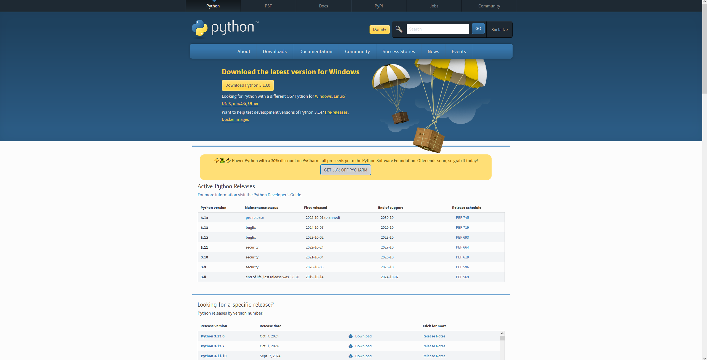
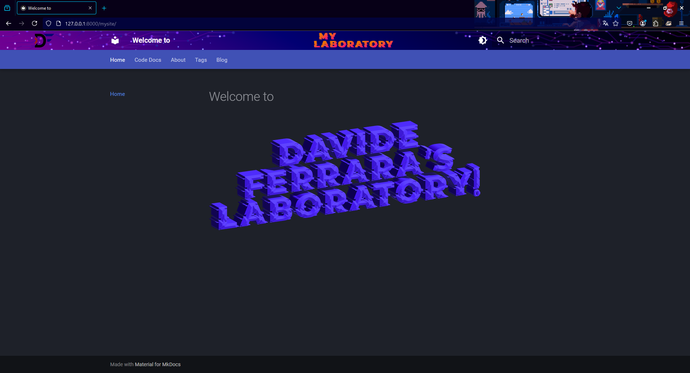

# Creazione di un sito web tramite MkDocs

Obiettivo: Realizzazione di un sito web tramite Mkdocs. 

## Fase 1: 
Scaricare Python.

## Fase 2:
Crea una cartella dove andranno tutte le sottocartelle che comporranno il sito.

## Fase 3:
Aprire Visual Studio Code ed entrare nella cartella precedentemente creata.
Aprire il terminale in V.S.C. e scrivere i seguenti comandi:

python -m venv venv

venv/Scripts/activate

pip install mkdocs-material

mkdocs new .

mkdocs serve

## Fase 4:
Personalizzare il sito nel modo in cui si desidera.

## Fase 5:
Collegare il sito all'interno del nostro Github attraverso i seguenti passaggi:

Creare la cartella ".github" al cui interno mettere un'altra cartella di nome "workflows", 
al cui interno creare un file di nome "ci.yml" e incollarci all'interno il contenuto del seguente link:

https://thomaswildetech.com/software-development/github/workflows/deploy-to-github-pages/

## Fase 6:
Creare un file di nome ".gitignore" e scriverci all'interno "venv" e poi sotto "site".

## Fase 7:
Andare nella zona del terminale denominata "powershell" e scrivere il comando "git add ." per caricare su github tutte le modifiche effettuate.

## Fase 8:
Andare nella sezione "Source Control" di V.S.C. e cliccare su "Commit" e successivamente su "Publish Branch".

## Fase 9:
Andare sul proprio Github, nel repository del sito appena creato, e andare nella sezione "Settings" poi "Pages" e sotto la voce "Source", cambiare da "Deploy from a branch" a "GitHub Actions".

Successivamente andare nella sezione actions e attendere che il proprio sito venga caricato correttamente.

Infine il sito si troverà nella sezione "Settings/Pages" come primo link in cima alla pagina, al quale si potrà accedere cliccando sul pulsante Visit site.

