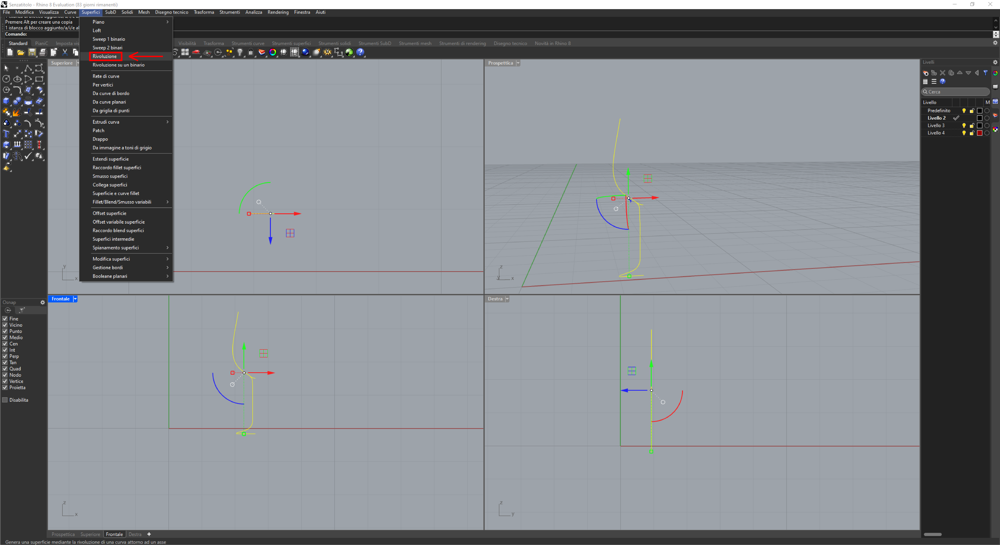

# Creazione di un modello 3D tramite l'utilizzo di programmi vettoriali

Obiettivo: Realizzazione di un modello 3D

## Fase 1:
Scaricare un qualsiasi programma che ti permetta di creare modelli 3D (in questo caso Rhinoceros).

## Fase 2:
Disegnare metà della sagoma dell'oggetto in questione.

## Fase 3:
Svolgi una rivoluzione della sagoma in modo da creare il modello 3D.

## fase 4:
Assegna un materiale alle superfici del modello appena creato.

## Fase 5:
Renderizza il modello.

